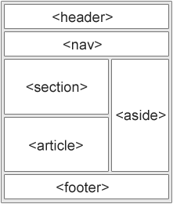

# HTML(Hyper Text Markup Language)

> 웹 페이지를 구조적으로 작성하기 위한 언어

* Hyper Text

  > 참조(hyperlink)를 통해 한 문서에서 다른 문서로 즉시 접근할 수 있는 텍스트

* Markup

  > 태그 등을 이용하여 문서나 데이터의 구조를 명시하기 위한 규칙들을 정의한 언어

* HTTP(Hyper Text Transfer Protocol)

  > Hyper Text를 주고 받는 규칙


### HTML 기본 구조

> DOM(Document Object Model) 트리
>
> 검색엔진최적화(SEO)를 위해 메타 태그, 시맨틱 태그 등을 활용하여 마크업을 효과적으로 할 필요가 있음


* 헤드(head)

  > 문서 제목, 문자 인코딩 등의 문서에 대한 정보를 담고 있음
  >
  > 메타데이터(metadata)를 통해 웹 문서에 대한 추가 정보 선언
  >
  > 외부 파일 연결(CSS, JS)

  * Open Graph Protocol

    > 페이스북에서 정의한 메타데이터(metadata)를 표현하는 새로운 규약

    ```html
    <head>
        <meta property="og:title" content="제목" />
        <meta property="og:type" content="사이트 분류" />
        <meta property="og:url" content="사이트 주소" />
        <meta property="og:image" content="사이트 대표 이미지" />
    </head>
    ```

    [메타 태그](https://metatags.io)

* 바디(body)

  > 문서의 내용을 나타냄

  * 요소(Element)

    > <여는태그>Contents<닫는태그>

  * 속성(Attribute)

    > <여는태그 속성명="속성값"><닫는태그>
    >
    > 태그별로 사용할 수 있는 속성이 다름


#### 시맨틱(Semantic) 태그

> HTML5에 도입된 의미론적 요소를 담은 태그
>
> 개발자 및 사용자 뿐만 아니라 검색엔진 등에 의미 있는 정보의 그룹을 태그로 표현
>
> 단순히 구역을 나누는 것 뿐만 아니라 의미를 가지는 태그들을 활용하기 위한 노력
>
> non-semantic 요소는 div, span 등이 있으며 h1, table 태그들도 시맨틱 태그로 볼 수 있음



* header

  > 페이지 또는 섹션의 머릿글 그룹, 제목, 소개, 네비게이션 등이 포함

* nav

  > 문서의 동일 페이지 또는 다른 페이지를 연결하는 네비게이션 링크로 구성되는 섹션

* aside

  > 문서의 주요 콘텐츠와 별개의 영역 정의, 대체로 사이드바 형태

* section

  > 보통 제목으로 시작하는 콘텐츠의 의미적 그룹

* article

  > 문서나 페이지, 사이트에서 독립적으로 배포 혹은 재사용 할 수 있는 섹션

* footer

  > 가장 가까운 조상 요소의 푸터, 섹션 요소가 아님


#### 인라인 / 블록 요소


#### 그룹 컨텐츠

* p

  > 문단, p요소 보다 더 적합한 요소가 있을 때에는 해당 요소를 사용함

* blockquote

  > 다른 소스로부터 가져온 인용 섹션
  >
  > 인용된 소스의 URL 주소가 있다면 cite 속성으로 표시

* pre

  > 형식화된 텍스트 블록을 표현

* hr

  > 문단 레벨에서의 주제의 분리, 마침 요소 없이 단독으로 사용

* 목록

  * ol

    > 순서가 바뀌면 의미가 바뀌는 목록

    * li

      > 목록 아이템을 정의

  * ul

    > 목록 아이템이 말머리 기호로 시작

    * li

      > 목록 아이템을 정의

* figure

  > 사진, 일러스트, 비디오 등을 표시

  * figcaption

    > figure요소 내용에 대한 캡션

* div

  > 스타일 또는 스크립트 목적으로 콘텐츠를 분리하기 위해 사용


#### 텍스트 관련 요소

> a
>
> b vs strong 강조 strong많이 쓰임
>
> i vs em 기울기?? em 많이 쓰임
>
> span br img
>
> 기타 등등


#### table

> tr td th
>
> thead tbody tfoot
>
> caption
>
> 셀 병합 속성: colspan rowspan
>
> scope 속성
>
> col colgroup


#### form

> form은 서버에서 처리될 데이터를 제공하는 역할
>
> form의 기본 속성
>
> action method


#### 웹 사이트 분석

크롬 웹 스토어에서 'Web Developer' 검색 및 추가


#### MDN

https://developer.mozilla.org/ko/